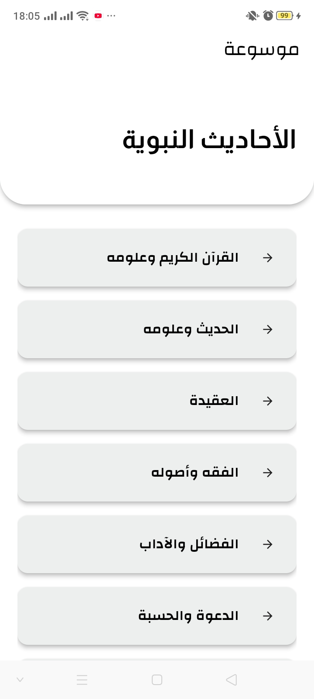
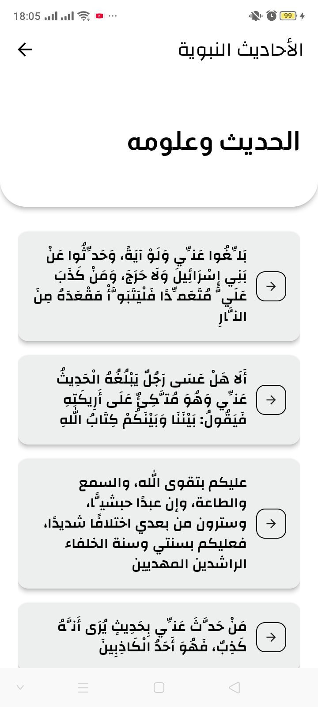

# موسوعة الأحاديث النبوية
# Mawsouaat Al Ahadith

## Overview
This is a simple Flutter application that demonstrates effective state management using the BLoC (Business Logic Component) pattern. The project follows a clean architecture approach, separating concerns into three layers: Data, Domain, and Presentation. Additionally, it integrates with the hadeethenc API to fetch and display data.

## Features
BLoC Pattern: Utilizes the BLoC pattern for efficient state management, ensuring a clean separation of business logic from the UI.

Clean Architecture: Adheres to a clean architecture by organizing code into three distinct layers - Data, Domain, and Presentation. This promotes modularity and maintainability.

API Integration: Communicates with the https://hadeethenc.com/api/v1 API to retrieve and display data. You can easily replace this API with your own or any other API of your choice.

## Screenshots
  
